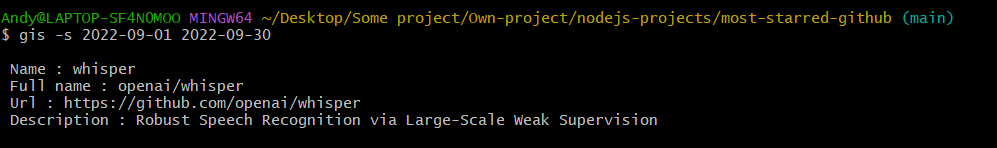

# github-search-starred

> CLI tool to search the most starred gothub project in between a time interval, using Github search API and Octokit.js

# Get started

Clone the repository and install all the packages

    git clone https://github.com/HandyyWeb/github-search-starred.git
    npm install

Install globally

    npm install -g

Get a token to make requests to the Github API by using the Github CLI tool (this is what I used), curl or Octokit.js directly.
More informations about how to create your token here: [Get Started](https://docs.github.com/fr/rest/quickstart?apiVersion=2022-11-28&tool=cli)
Once you have installed Github CLI, run `gh auth login`, to get yout token, run `gh auth token`.

# Documentation

To see how it works, run `gis --help`

     gis --help
    Usage : gis <start date YYYY-MM-DD> <end date YYYY-MM-DD>

    Options:
        --version  Show version number                                   [boolean]
    -s, --summary  Get a light overview of the repository                  [array]
        --help     Show help                                             [boolean]

# Basic usage

Get the most starred github repository by running :

    gis <start date YYYY-MM-DD> <end date YYYY-MM-DD>

Example :

    gis 2022-09-01 2022-09-30
    {
      id: 537603333,
      node_id: 'R_kgDOIAstBQ',
      name: 'whisper',
      full_name: 'openai/whisper',
      private: false,
      owner: {
        login: 'openai',
        id: 14957082,
        node_id: 'MDEyOk9yZ2FuaXphdGlvbjE0OTU3MDgy',
        avatar_url: 'https://avatars.githubusercontent.com/u/14957082?v=4',
        gravatar_id: '',
        url: 'https://api.github.com/users/openai',
        html_url: 'https://github.com/openai',
        followers_url: 'https://api.github.com/users/openai/followers',
        following_url: 'https://api.github.com/users/openai/following{/other_user}',
        gists_url: 'https://api.github.com/users/openai/gists{/gist_id}',
        starred_url: 'https://api.github.com/users/openai/starred{/owner}{/repo}',
        subscriptions_url: 'https://api.github.com/users/openai/subscriptions',
        organizations_url: 'https://api.github.com/users/openai/orgs',
        repos_url: 'https://api.github.com/users/openai/repos',
        events_url: 'https://api.github.com/users/openai/events{/privacy}',
        received_events_url: 'https://api.github.com/users/openai/received_events',
        type: 'Organization',
        site_admin: false
      },
      html_url: 'https://github.com/openai/whisper',
      description: 'Robust Speech Recognition via Large-Scale Weak Supervision',
      fork: false,
      url: 'https://api.github.com/repos/openai/whisper',
      forks_url: 'https://api.github.com/repos/openai/whisper/forks',
      keys_url: 'https://api.github.com/repos/openai/whisper/keys{/key_id}',
      collaborators_url: 'https://api.github.com/repos/openai/whisper/collaborators{/collaborator}',
      teams_url: 'https://api.github.com/repos/openai/whisper/teams',
      hooks_url: 'https://api.github.com/repos/openai/whisper/hooks',
      issue_events_url: 'https://api.github.com/repos/openai/whisper/issues/events{/number}',
      events_url: 'https://api.github.com/repos/openai/whisper/events',
      assignees_url: 'https://api.github.com/repos/openai/whisper/assignees{/user}',
      branches_url: 'https://api.github.com/repos/openai/whisper/branches{/branch}',
      tags_url: 'https://api.github.com/repos/openai/whisper/tags',
      blobs_url: 'https://api.github.com/repos/openai/whisper/git/blobs{/sha}',
      git_tags_url: 'https://api.github.com/repos/openai/whisper/git/tags{/sha}',
      git_refs_url: 'https://api.github.com/repos/openai/whisper/git/refs{/sha}',
      trees_url: 'https://api.github.com/repos/openai/whisper/git/trees{/sha}',
      statuses_url: 'https://api.github.com/repos/openai/whisper/statuses/{sha}',
      languages_url: 'https://api.github.com/repos/openai/whisper/languages',
      stargazers_url: 'https://api.github.com/repos/openai/whisper/stargazers',
      contributors_url: 'https://api.github.com/repos/openai/whisper/contributors',
      subscribers_url: 'https://api.github.com/repos/openai/whisper/subscribers',
      subscription_url: 'https://api.github.com/repos/openai/whisper/subscription',
      commits_url: 'https://api.github.com/repos/openai/whisper/commits{/sha}',
      git_commits_url: 'https://api.github.com/repos/openai/whisper/git/commits{/sha}',
      comments_url: 'https://api.github.com/repos/openai/whisper/comments{/number}',
      issue_comment_url: 'https://api.github.com/repos/openai/whisper/issues/comments{/number}',
      contents_url: 'https://api.github.com/repos/openai/whisper/contents/{+path}',
      compare_url: 'https://api.github.com/repos/openai/whisper/compare/{base}...{head}',
      merges_url: 'https://api.github.com/repos/openai/whisper/merges',
      archive_url: 'https://api.github.com/repos/openai/whisper/{archive_format}{/ref}',
      downloads_url: 'https://api.github.com/repos/openai/whisper/downloads',
      issues_url: 'https://api.github.com/repos/openai/whisper/issues{/number}',
      pulls_url: 'https://api.github.com/repos/openai/whisper/pulls{/number}',
      milestones_url: 'https://api.github.com/repos/openai/whisper/milestones{/number}',
      notifications_url: 'https://api.github.com/repos/openai/whisper/notifications{?since,all,participating}',
      labels_url: 'https://api.github.com/repos/openai/whisper/labels{/name}',
      releases_url: 'https://api.github.com/repos/openai/whisper/releases{/id}',
      deployments_url: 'https://api.github.com/repos/openai/whisper/deployments',
      created_at: '2022-09-16T20:02:54Z',
      updated_at: '2023-10-14T07:27:48Z',
      pushed_at: '2023-10-11T18:03:57Z',
      git_url: 'git://github.com/openai/whisper.git',
      ssh_url: 'git@github.com:openai/whisper.git',
      clone_url: 'https://github.com/openai/whisper.git',
      svn_url: 'https://github.com/openai/whisper',
      homepage: '',
      size: 8403,
      stargazers_count: 46118,
      watchers_count: 46118,
      language: 'Python',
      has_issues: false,
      has_projects: false,
      has_downloads: true,
      has_wiki: false,
      has_pages: false,
      has_discussions: true,
      forks_count: 5290,
      mirror_url: null,
      archived: false,
      disabled: false,
      open_issues_count: 30,
      license: {
        key: 'mit',
        name: 'MIT License',
        spdx_id: 'MIT',
        url: 'https://api.github.com/licenses/mit',
        node_id: 'MDc6TGljZW5zZTEz'
      },
      allow_forking: true,
      is_template: false,
      web_commit_signoff_required: false,
      topics: [],
      visibility: 'public',
      forks: 5290,
      open_issues: 30,
      watchers: 46118,
      default_branch: 'main',
      permissions: {
        admin: false,
        maintain: false,
        push: false,
        triage: false,
        pull: true
      },
      score: 1
    }

# Summary

Get just as simple summary of the most starred github repository by running :

    gis -s <start date YYYY-MM-DD> <end date YYYY-MM-DD>
    gis --summary <start date YYYY-MM-DD> <end date YYYY-MM-DD>

Example :

    gis -s 2022-09-01 2022-09-30

    Name : whisper
    Full name : openai/whisper
    Url : https://github.com/openai/whisper
    Description : Robust Speech Recognition via Large-Scale Weak Supervision

# Other libraries

Get more informations about :

- Octokit.js : [Octokit.js](https://github.com/octokit)

- yargs : [Yargs](https://yargs.js.org/)

# Author & Contacts

Lebreton Andy

E-mail : lebreton.andy@proton.me
